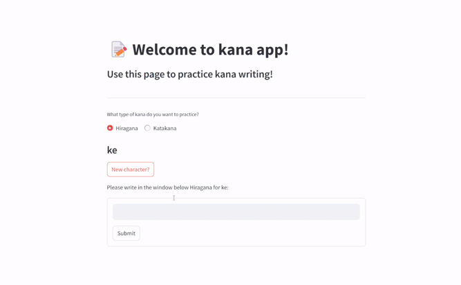

# Streamlit Kana app with AWS deployment

Learn Japanese kana (Katakana, Hiragana) with the help of a Streamlit app deployed on AWS!


## If you need deployment to HTTPS

If you want to increase solution security, please use the [`deploy-https`](https://github.com/dashapetr/kana--streamlit-app/tree/deploy-https) branch.

## What possibilities does Kana app include?

[kana-app.mp4](images%2Fkana-app.mp4)

### 1- Learn kana characters:


### 2 - Given romaji (pronunciation), write kana:



### 3 - Given kana, transcribe it:


## What is Streamlit?

Streamlit is an open-source Python library that makes it easy to create and share custom web apps for machine learning and data science. By using Streamlit you can quickly build and deploy powerful data applications. For more information about the open-source library, see the [Streamlit documentation](https://docs.streamlit.io/).

## What is Japanese kana?

|  | 
|:--:| 
| *[Image source](https://www.mlcjapanese.co.jp/hiragana_katakana.html)* |

The modern Japanese writing system uses a combination of logographic kanji, which are adopted Chinese characters, and syllabic kana. 
Kana itself consists of a pair of syllabaries: **hiragana**, used primarily for native or naturalized Japanese words and grammatical elements; 
and **katakana**, used primarily for foreign words and names, loanwords. Almost all written Japanese sentences contain a mixture of kanji and kana.
(Source: [Japanese writing system](https://en.wikipedia.org/wiki/Japanese_writing_system))

## Let's build!

### Prerequisites

- AWS Account
- [AWS CDK](https://docs.aws.amazon.com/cdk/v2/guide/getting_started.html)
- [AWS CLI](https://docs.aws.amazon.com/cli/latest/userguide/getting-started-install.html)
- Docker

### Project structure

```bash
.
├── README.md
└── cdk
    ├── app
    │   ├── Dockerfile
    │   ├── __init__.py
    │   ├── config.py
    │   ├── init_streamlit_app.py
    │   ├── 000_Learn_Kana.py
    │   ├── 00_Romaji_to_kana.py
    │   ├── 01_Kana_to_romaji.py
    │   ├── requirements.txt
    │   └── img
    │       ├── Hiragana.jpg
    │       └── Katakana.jpg
    ├── cdk
    │   ├── __init__.py
    │   ├── config.py
    │   └── cdk_stack.py
    ├── .gitignore
    ├── app.py
    ├── cdk.json
    ├── requirements.txt
    ├── setup.py
    └── source.bat
```

### 1- Create your Streamlit application

#### What's inside streamlit app

#### Test your application

#### What's inside Dockerfile

#### Build image and run locally for debugging

### 2 - Deploy your Streamlit app to AWS Fargate using AWS CDK

## Conclusion and more ideas

## Issues I faced and what I learned
