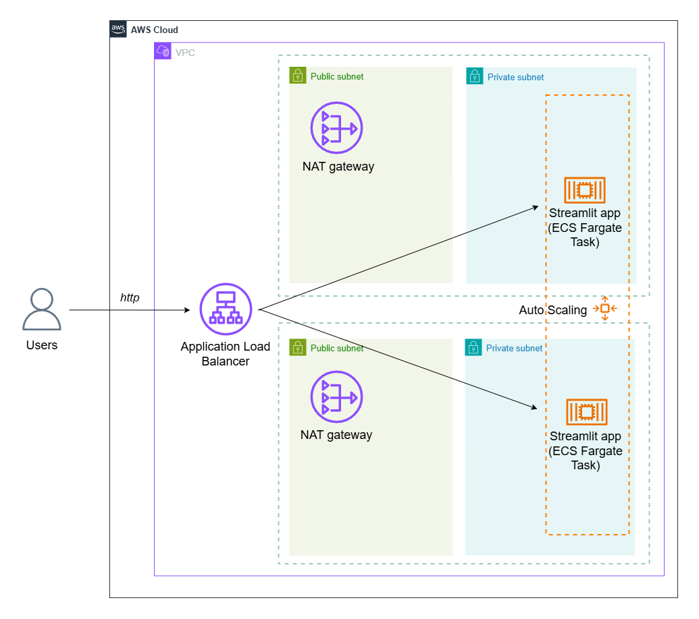
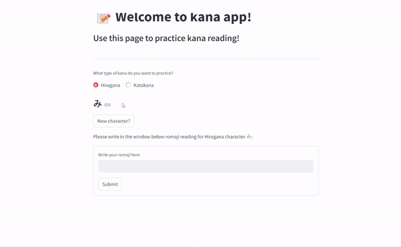
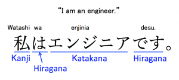
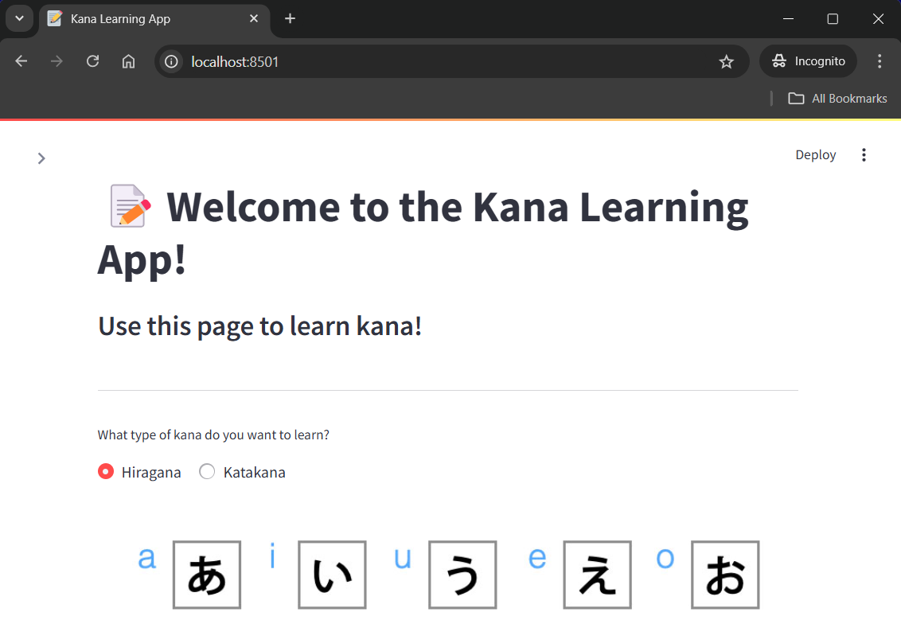

# Streamlit Kana app with AWS deployment

Learn Japanese kana (Katakana, Hiragana) with the help of a Streamlit app deployed on AWS!



## If you need deployment to HTTPS

If you want to increase solution security, please use the [`deploy-https`](https://github.com/dashapetr/kana--streamlit-app/tree/deploy-https) branch.

## What possibilities does Kana app include?

### 1- Learn kana characters:


### 2 - Given romaji (pronunciation), write kana:


### 3 - Given kana, transcribe it:



## What is Streamlit?

Streamlit is an open-source Python library that makes it easy to create and share custom web apps for machine learning and data science. By using Streamlit you can quickly build and deploy powerful data applications. For more information about the open-source library, see the [Streamlit documentation](https://docs.streamlit.io/).

## What is Japanese kana?

|  | 
|:---------------------------------------------------------------------------:| 
| *[Image source](https://www.mlcjapanese.co.jp/hiragana_katakana.html)*      |

The modern Japanese writing system uses a combination of logographic kanji, which are adopted Chinese characters, and syllabic kana. 
Kana itself consists of a pair of syllabaries: **hiragana**, used primarily for native or naturalized Japanese words and grammatical elements; 
and **katakana**, used primarily for foreign words and names, loanwords. Almost all written Japanese sentences contain a mixture of kanji and kana.
(Source: [Japanese writing system](https://en.wikipedia.org/wiki/Japanese_writing_system))

## Let's build!

### Prerequisites

- AWS Account
- [AWS CDK](https://docs.aws.amazon.com/cdk/v2/guide/getting_started.html)
- [AWS CLI](https://docs.aws.amazon.com/cli/latest/userguide/getting-started-install.html)
- Docker

### Project structure

```bash
.
├── README.md
└── cdk
    ├── app
    │   ├── Dockerfile
    │   ├── __init__.py
    │   ├── config.py
    │   ├── init_streamlit_app.py
    │   ├── 000_Learn_Kana.py
    │   ├── 00_Romaji_to_kana.py
    │   ├── 01_Kana_to_romaji.py
    │   ├── preload_model.py
    │   ├── requirements.txt
    │   └── img
    │       ├── Hiragana.jpg
    │       └── Katakana.jpg
    ├── cdk
    │   ├── __init__.py
    │   ├── config.py
    │   └── cdk_stack.py
    ├── .gitignore
    ├── app.py
    ├── cdk.json
    ├── requirements.txt
    ├── setup.py
    └── source.bat
```

### 1- Create your Streamlit application

#### What's inside streamlit app

0️⃣ Streamlit app starts from the `init_streamlit_app.py`. This simple module serves as an entrypoint for the Docker image. 
From here, we have a 'roadmap' to 3 app pages:

```python
pg = st.navigation([st.Page(page="000_Learn_Kana.py", url_path='Learn_Kana'),
                    st.Page(page="00_Romaji_to_kana.py", url_path='Romaji_to_kana'),
                    st.Page(page="01_Kana_to_romaji.py", url_path='Kana_to_romaji')])
```

1️⃣ The first page `000_Learn_Kana.py` contains a simple mode switcher (Hiragana | Katakana):

```python
st.session_state.study_mode = st.radio(
    "What type of kana do you want to learn?",
    ["Hiragana", "Katakana"],
    horizontal=True
)
```
Depending on the user choice, a relevant Kana image is displayed:

```python
image_path = f"img/{st.session_state.study_mode}.jpg"
try:
    st.image(image_path,
             caption=f"{st.session_state.study_mode} Chart. "
                     f"Source: https://www.japanistry.com/hiragana-katakana/")
```

2️⃣ The second page `00_Romaji_to_kana.py` contains the same mode switcher functionality. When a user select mode, a random Kana pronunciation appears.
There is a button to randomly select a new Kana pronunciation (this button don't change mode):
```python
st.button("New character?", on_click=change_romaji)
```
When a user changes mode, there is a force mode update inside `change_mode` function to make sure that the corresponding Kana is selected. 

The most important part is a drawable canvas from the `streamlit-drawable-canvas` component. 
It is implemented inside `st.form` to avoid page reloading while drawing. 
When a user has finished the drawing, they press form's "Submit" button:

```python
submitted = st.form_submit_button("Submit")
    if submitted:
        # Save the user's drawing as an image
        img_data = canvas_result.image_data
        im = Image.fromarray(img_data.astype("uint8"), mode="RGBA")
        im.save(file_path, "PNG")

        # Use OCR to recognize the character
        user_result = recognize_character(st.session_state.mocr)
```
The drawing is saved as an image, and this image is being processed by an open source OCR model that recognizes the written character (more on the model below).

If the user result equals the actual Kana character, balloons are flying! 🎉

```python
if CHECK_KANA_DICT.get(st.session_state.mode).get(st.session_state.romaji) == user_result:
            st.success(f'Yes,   {st.session_state.romaji}   is "{user_result}"!', icon="✅")
            st.balloons()
        else:
            st.error(f'No,   {st.session_state.romaji}   is NOT "{user_result}"!', icon="🚨")
```

3️⃣ The third page `01_Kana_to_romaji.py` structure is similar to the previous page. 
It has the mode switcher, New character button, and form to accept the user response.

This time, there is no drawable canvas, because a user is supposed to write text (romaji, latin characters).
The input is converted to lowercase to make it case-insensitive.

```python
user_romaji = st.text_input("Write your romaji here", "")
user_romaji_lower_case = user_romaji.lower()
```

#### Test your application

Go to your terminal and clone this repository:
```
$ git clone https://github.com/dashapetr/kana--streamlit-app.git
```

Now, cd into cdk/app. Create virtual environment, activate it, then install all dependencies.
```
$ cd kana--streamlit-app/cdk/app
$ python -m venv .env
$ .env\scripts\activate
$ pip install -r requirements.txt
```

Then, run `preload_model.py` script. It downloads the Manga OCR model from the HuggingFace hub.
The model provides optical character recognition for Japanese text, with the main focus being Japanese manga.
It uses [Vision Encoder Decoder](https://huggingface.co/docs/transformers/model_doc/vision-encoder-decoder) framework.

```
$ python preload_model.py
```


Now, we are all set to test the streamlit app! Run the command, then click on the url and view the app inside your browser.
```
$ streamlit run init_streamlit_app.py
```


#### What's inside Dockerfile

We are using an official lightweight Python image, then setting the working directory in the container, copying the app files into the container, 
and installing system dependencies:
```dockerfile
FROM python:3.11-slim
WORKDIR /app
COPY . .
RUN apt-get update && apt-get install -y \
    git \
    wget \
    && rm -rf /var/lib/apt/lists/*
```
Next, we install Python dependencies, preload the Hugging Face model, expose Streamlit port, and finally run the app:
```dockerfile
RUN pip install --no-cache-dir -r requirements.txt huggingface-hub
RUN python preload_model.py
EXPOSE 8501
CMD ["streamlit", "run", "init_streamlit_app.py", "--server.port=8501", "--server.address=0.0.0.0"]
```

#### Build image and run locally for debugging

Run the following command in your terminal inside ./cdk/app to build your container image. It may take around 5-7 mins.
```
$ docker build -t test/kana-app .
```
Now run the container:
```
$ docker run -it --rm -p "8501:8501" test/kana-app
```
And if you open your browser and go to http://localhost:8501/, you should be able to see the app! Great! 🥳



### 2 - Deploy your Streamlit app to AWS Fargate using AWS CDK

## Conclusion

### Issues I faced and what I learned


### Kudos and special thanks

- Nicolás Metallo [tutorial](https://github.com/nicolasmetallo/deploy-streamlit-on-fargate-with-aws-cdk/tree/master). I took a structure from their repo; `cdk_stack.py` code allowed me to start quickly and build on top of it.  
- lperez31's [deploy-streamlit-app](https://github.com/aws-samples/deploy-streamlit-app/tree/main) project provided insights on enhancements
- Eashan Kaushik's [Deploy Streamlit App on ECS](https://github.com/aws-samples/streamlit-deploy) project was my inspiration for architecture diagrams

### More ideas

- The current app version supports simple Katakana and Hiragana, without dakuten and handakuten. Kanji are not included as well. To include all mentioned characters, more accurate model is required. Potentially, the [DaKanji-Single-Kanji-Recognition](https://github.com/CaptainDario/DaKanji-Single-Kanji-Recognition) repo can be used to achieve the goal.
- You can enhance security by adding user authentication with [Amazon Cognito](https://aws.amazon.com/pm/cognito/).
- AWS provides various services that can improve the security of this application. You could use AWS Shield for DDoS protection and Amazon GuardDuty for threats detection. Amazon Inspector performs security assessments. There are many more AWS services and best practices that can enhance security - refer to the [AWS Shared Responsibility Model](https://aws.amazon.com/compliance/shared-responsibility-model/) and security best practices guidance for additional recommendations.
- Regular rotation of secrets is recommended, can be configured additionally.
